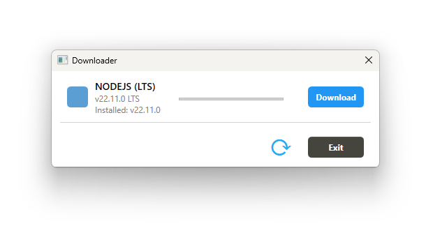

# Node.js Installer with C# and WPF

This project in C# uses Windows Presentation Foundation (WPF) to create a desktop application that allows downloading, installing, and configuring Node.js on Windows systems. The application also checks if there is already an installed version of Node.js on the machine and, if necessary, updates the `PATH` environment variable for proper functioning.



## Features

- **Node.js Download**: The application allows downloading the latest version of Node.js from the official website.
- **Automatic Installation**: Installs Node.js on the system.
- **Installed Version Verification**: Checks if there is an existing Node.js version installed on the system.
- **`PATH` Environment Variable Update**: Adds the Node.js path to the system `PATH` to allow its execution from any location in the console.
- **Administrator Permissions Required**: Modifying the system `PATH` variable requires elevated permissions.

## Prerequisites

- **Operating System**: Windows 10 or higher.
- **Administrator Permissions**: The application must be run with administrator privileges to modify the `PATH` environment variable.

## Installation

1. Clone this repository or download the source code.

   ```bash
   git clone https://github.com/username/node-installer-repository.git
